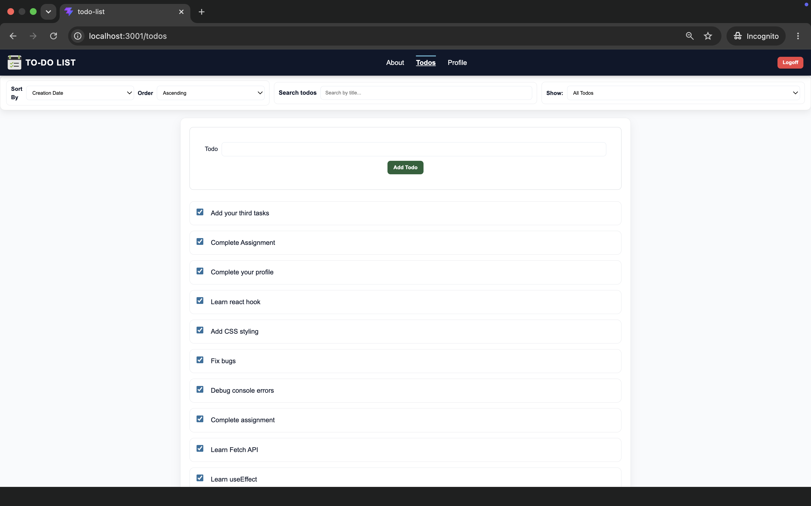
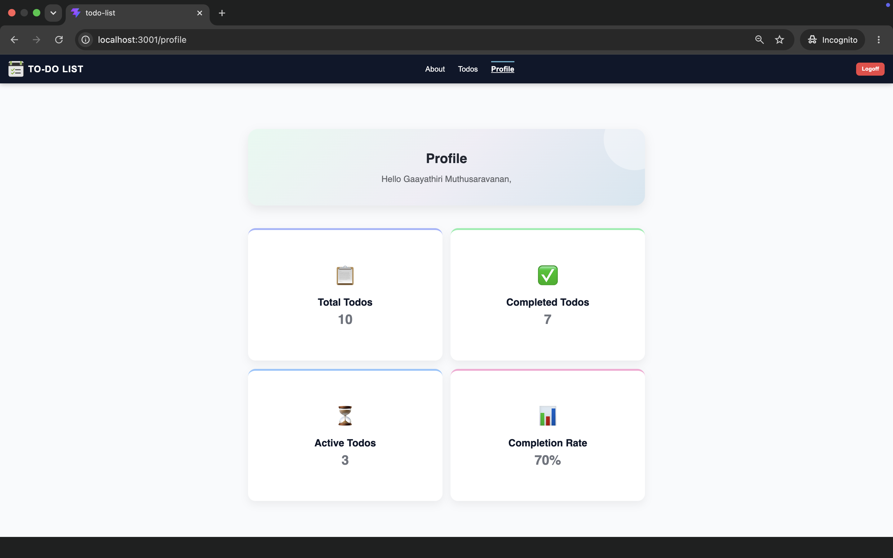
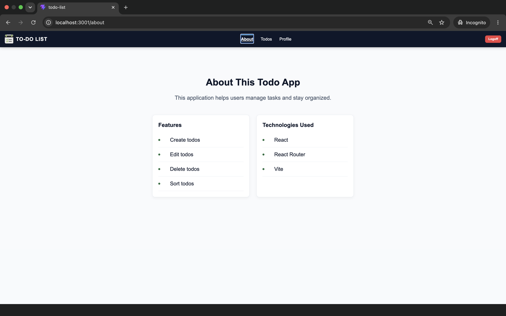
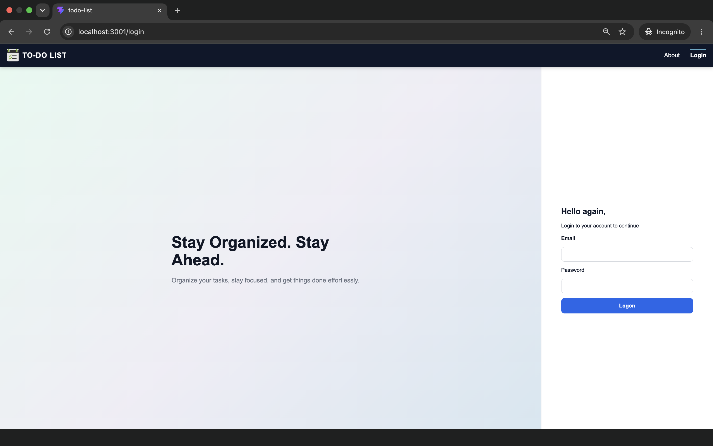
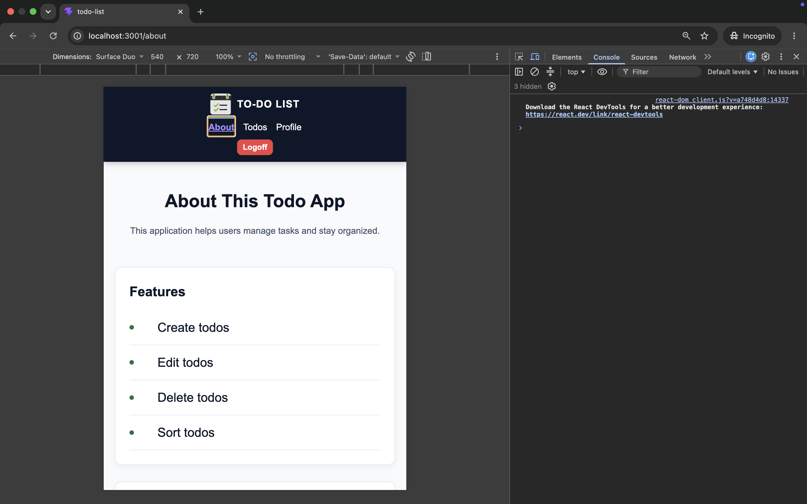
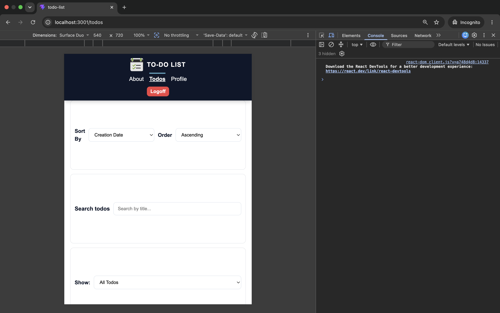
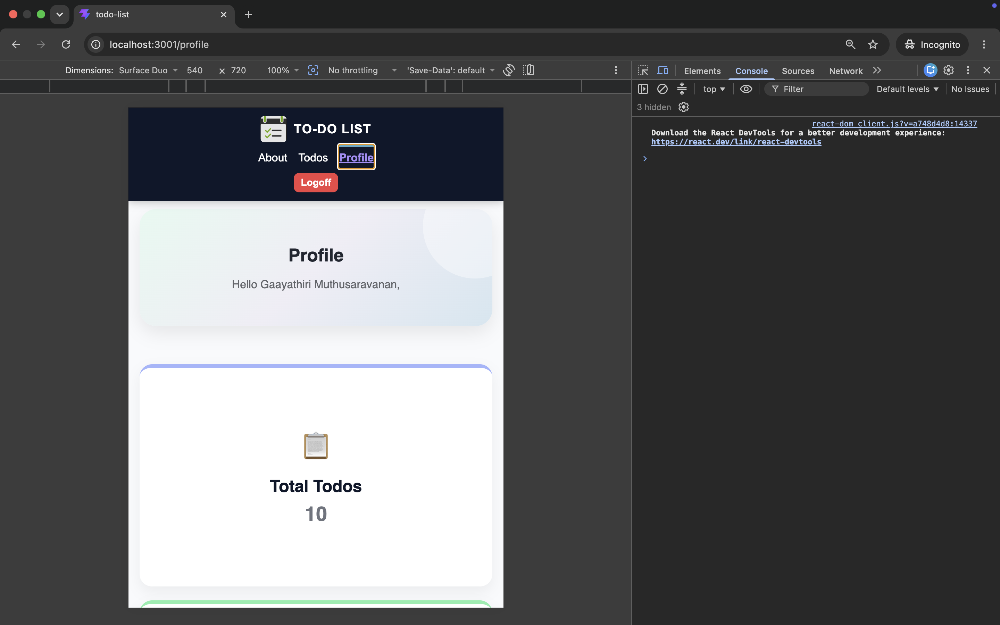
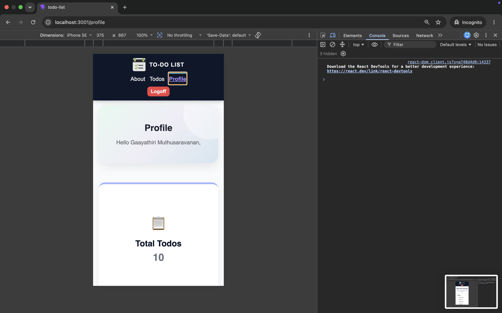
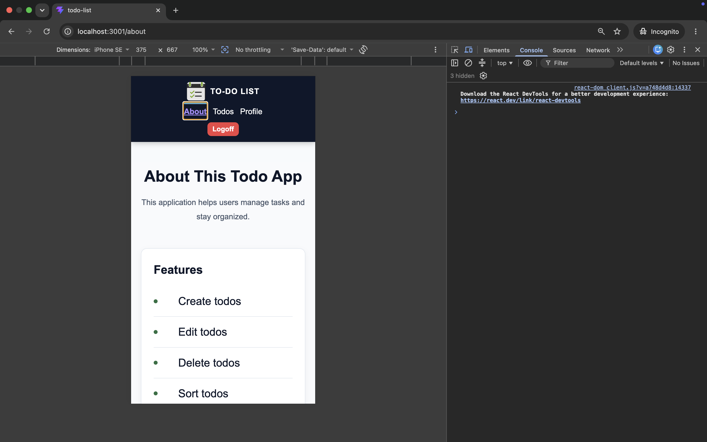
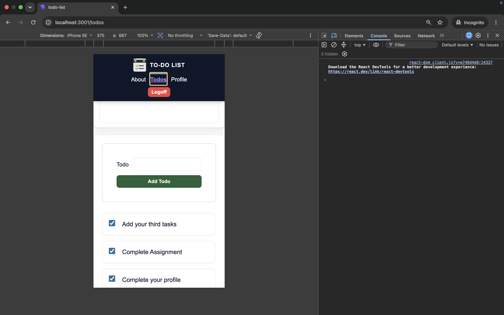

# Todo List App

## Project Title and Description
TodoList App
A simple Todo List application built using React and Vite. This app displays a list of todos and demonstrates basic React concepts like components and rendering lists.
## Live Demo

https://todo-list-o7i10a8f3-gaayathiri-muthusaravanans-projects.vercel.app
## Features
- User authentication (login/logout)
- Add, edit, delete todos
- Mark todos as complete
- Filter and sort tasks
- Responsive UI design
- Protected API routes

## Technologies Used
- React.js
- Vite
- React Router
- CSS Modules
- Vercel (deployment)

### Screenshots

### Desktop View
 

### Tablet view

### Mobile View

 ### Getting Started Section: Prerequisites and installation instructions

## Installation
Bootstrap a new project: npx create-vite@latest --template react .
After any prompts, install the project dependencies using NPM: npm install

## Running the Development Server
npm run dev

Then open your browser and go to : http://localhost:5173

## Design Decisions

I chose **CSS Modules** for styling because it helps keep styles scoped to individual components. This prevents class name conflicts and makes the code more maintainable and scalable.

The UI is designed with a clean and minimal layout to improve usability and focus on task management. Flexbox and CSS Grid are used for responsive layouts.

---

## Future Improvements

- Add backend database 
- Add dark mode / theme switcher
- Add due dates and reminders

---

## 🔒 Security Features

- Input sanitization using DOMPurify
- Form validation before submission

##  Available Scripts

In the project directory, you can run:

### `npm install`
Installs all project dependencies.

### `npm run dev`
Runs the app in development mode.  
Open http://localhost:5173 to view it in the browser.

### `npm run build`
Builds the app for production in the `dist` folder.

### `npm run preview`
Locally preview the production build.
## License
This project is licensed under the MIT License.
You are free to use, modify, and distribute this project for personal or commercial purposes.

## Contact

github: https://github.com/Gaayathiri-Muthusaravanan

